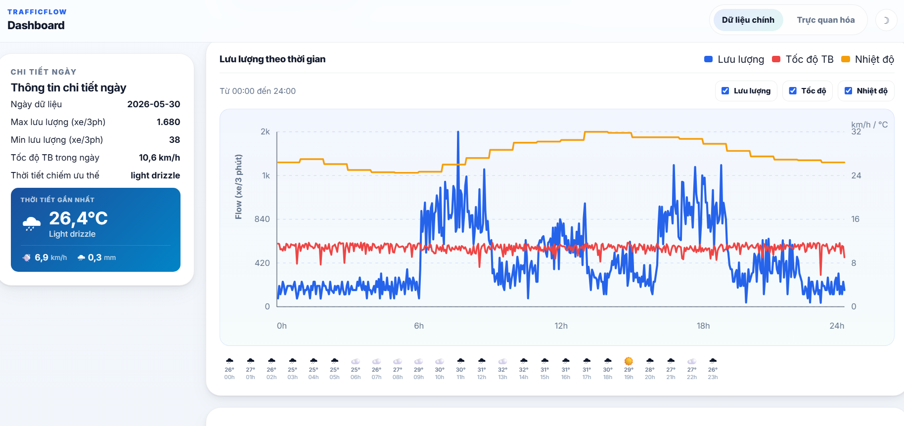
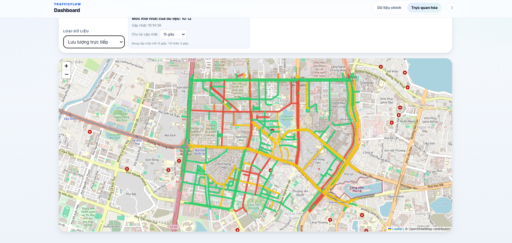
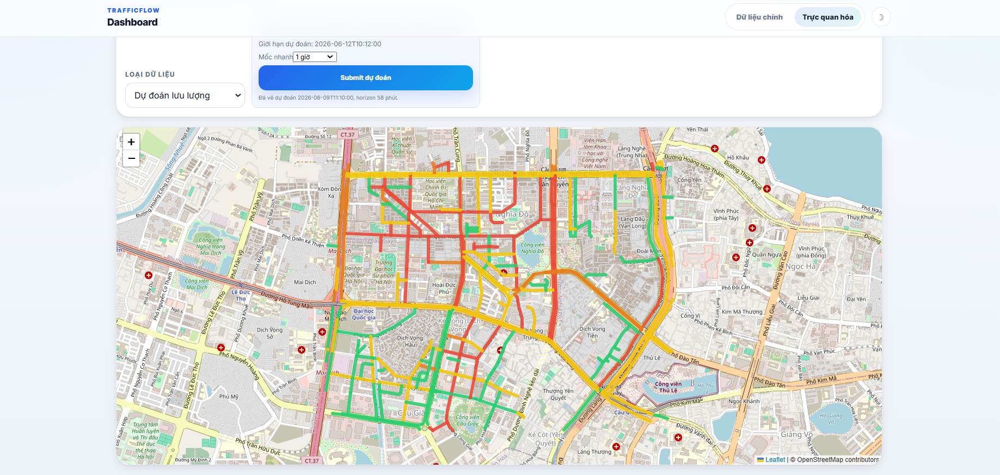
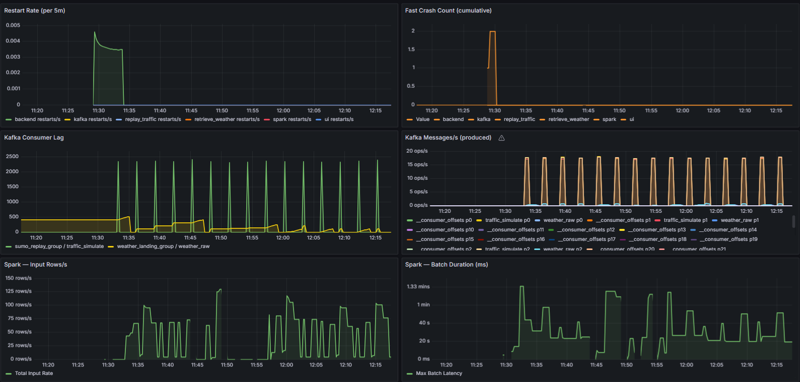

# Real-Time Traffic Monitoring Pipeline

A near real-time traffic monitoring system for urban road networks in Hanoi, Vietnam.

> **This project is developed for educational purposes**

---

## Team

Bui Manh Nam - 23020556 

Chu Anh Truong - 23020577 

Nong Son Tung - 23020571 

Pham Quang Vinh - 23020580 

Nguyen Quang Vinh - 23020579

**University:** VNU University of Engineering and Technology (UET)

---

## Description

This system monitors traffic flow, congestion levels, and weather conditions across multiple roads in Hanoi in near real-time. It provides:

- A live dashboard showing current traffic status, vehicle counts, average speeds, and weather
- Historical data browsing and comparison across dates and roads
- Traffic flow forecasting using machine learning models
- An interactive road map with congestion color coding

**Tech stack:** Apache Kafka · Apache Spark · Delta Lake · Google Cloud Storage · FastAPI · Next.js 15 · Prometheus · Grafana · Docker

---

## Prerequisites

- Java 11 or 17
- Apache Kafka 3.x (KRaft mode, 3-node cluster)
- Apache Spark 3.5.1
- Python 3.12+
- Node.js 18+
- Docker + Docker Compose
- A Google Cloud Storage bucket with write access

---

## Installation

### 1. Clone

```bash
git clone <repo-url>
cd Project
```

### 2. Python environment

```bash
# Pipeline dependencies
python3 -m venv venv
source venv/bin/activate
pip install -r requirements.txt

# Dashboard backend dependencies
pip install -r dashboard/backend/requirements.txt
```

### 3. Frontend

```bash
cd dashboard/frontend
npm install
npm run build
cd ../..
```

### 4. Environment variables

```bash
cp .env.example .env
# Edit .env with your values
```

Key variables:

| Variable | Description |
|---|---|
| `KAFKA_CLUSTER_ID` | KRaft cluster ID — generate with `kafka-storage.sh random-uuid` |
| `KAFKA_BOOTSTRAP_SERVERS` | e.g. `master:9092` |
| `SPARK_MASTER` | e.g. `spark://master:7077` |
| `GCS_BUCKET_NAME` | Your GCS bucket name |
| `GOOGLE_APPLICATION_CREDENTIALS` | Path to GCP service account key (omit if using ADC) |

Binary paths (`SPARK_SUBMIT`, `UVICORN_BIN`, `NPM_BIN`) are auto-detected at runtime. Override in `.env` only if auto-detection fails.

### 5. SUMO simulation data (one-time)

```bash
python Landing/retrieve_sumo_traffic.py
# or for a specific date range:
python Landing/retrieve_sumo_traffic.py --start-date 2026-05-01 --end-date 2026-05-31
```

---

## Running

### Step 1 — Start infrastructure (Kafka + Spark + Docker)

```bash
bash run.sh
```

### Step 2 — Start the pipeline

```bash
source venv/bin/activate
python main.py              # today's data
python main.py 2026-05-27   # replay a specific date
```

### Stop

```bash
Ctrl+C              # stop pipeline
bash stop.sh        # stop infrastructure
```

---

## Web Interfaces

| Interface | URL |
|---|---|
| Dashboard | `http://<master-ip>:3000` |
| API docs | `http://<master-ip>:8001/docs` |
| Spark UI | `http://<master-ip>:8080` |
| Kafka UI | `http://<master-ip>:8085` |
| Grafana | `http://<master-ip>:3001` |
| Prometheus | `http://<master-ip>:9090` |

---

## Demo

| View | Screenshot |
|---|---|
| Main dashboard |  |
| Realtime Map |  |
| Congestion Forecast Map |  |
| Grafana metrics |  |

---

## Backfill

Process a past date the pipeline missed:

```bash
source venv/bin/activate
spark-submit --packages io.delta:delta-spark_2.12:3.2.0 backfill.py 2026-05-27
```
